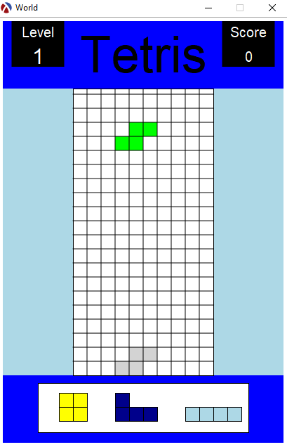
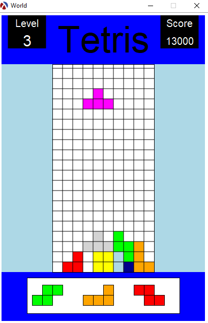

# Racket Tetris

This project was first intended as a maturita project, later on reused and revised
as a semestral work in "Programming paradigmes" course of [FIT CVUT](https://fit.cvut.cz/cs).

The game is developed using Racket's built-in `universe.rkt` package found [here](https://docs.racket-lang.org/teachpack/2htdpuniverse.html).
*Test-driven development* technique was used.

## Features
- Levels (increasing speed based on score)
- Score (including combos)
- Pause
- Music

## Sound vs. No Sound
Both folders have the same game, but the one in volume also contains looping music.

For music to work we need to have [rsound](https://docs.racket-lang.org/rsound/index.html) installed and also [portaudio](http://files.portaudio.com/download.html). Last time I checked Windows could not support the sound version requirements, but Linux was fine.

## How to start

Get [DrRacket](https://download.racket-lang.org/) (comes with Racket)

**Game:** Open tetris.rkt file in DrRacket and click on green arrow. The game starts by executing NORMAL-START. For starting at higher levels NORMAL-START in tetris.rkt can be commented out and other starts can be used instead.

**Tests:** Navigate to test/ folder and open any test file in DrRacket and click on green arrow.

## Controls:
**Movement:** Arrow keys

**Fast-fall:** Enter

**Pause:** P

## Screenshots

<h4>Start of game</h4>

<h4>Level 3</h4>

